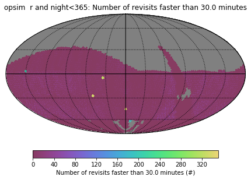

#  - Week of 06/19/2019

## 1. Papers and code

### 1.1 Papers Read

[likelihood ratio test]() :

### 1.2 Code Written

 [snModel.py](https://github.com/xiaolng/maf/blob/master/snModel.ipynb) : 

wp12.py: explore two more metrics used in paper, 

## 2. Figures

Figure 1: 

