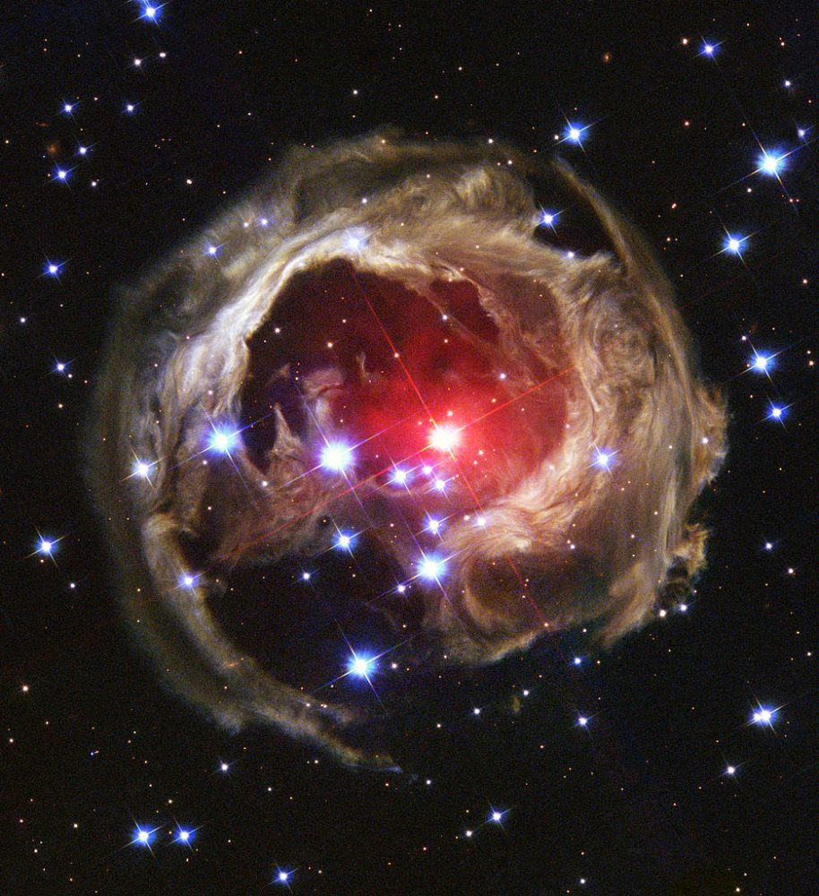

# Xiaolong - Week of 08/30/2019

## 1. Papers and code

### 1.1 Papers Read

#### List of light echos
- [V838 Monocerotis]()
- [SNR 0509-67.5](https://arxiv.org/pdf/0801.4762.pdf)
- [Tycho’s 1572 supernova](https://www.nature.com/articles/nature07608)
- [SN 2007af]()
- [SN 2003gb](https://iopscience.iop.org/article/10.1086/497578/meta)
- [SN 1991T](https://iopscience.iop.org/article/10.1086/307766)
- [SN 1987](https://iopscience.iop.org/article/10.1088/0004-637X/767/1/45)
- [Eta Carinae]()
### 1.2 Code Written

## 2. Figures

## 3. Results

I read several papers about light echos. 