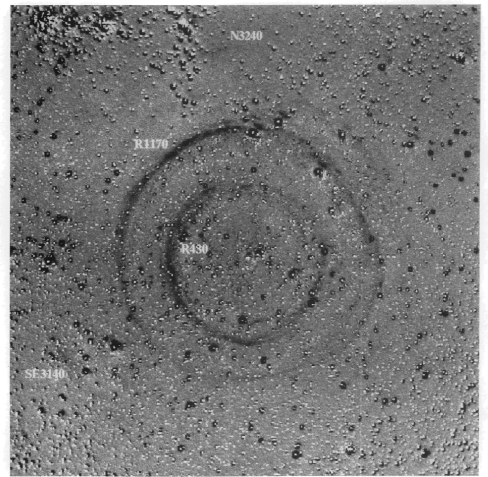

# Xiaolong - Week of 08/30/2019

## 1. Papers and code

### 1.1 Papers Read

I read some papers about light echos. 

- [V838 Monocerotis]()
- [SNR 0509-67.5](https://arxiv.org/pdf/0801.4762.pdf)
- [Tycho’s 1572 supernova](https://www.nature.com/articles/nature07608)
- [SN 2007af]()
- [SN 2003gb](https://iopscience.iop.org/article/10.1086/497578/meta)
- [SN 1991T](https://iopscience.iop.org/article/10.1086/307766)
- [SN 1987](https://iopscience.iop.org/article/10.1088/0004-637X/767/1/45)
- [Eta Carinae]()
### 1.2 Code Written

: A simple implementation of GANs using keras. GAN is a unsupervised learning method that can be used to generate similar samples from datasets. 

## 2. Figures

Figure 1.  The light echo around variable star V838 Monocerotis observed by the Hubble Space Telescope. 

Figure 2. The light echo from  supernova SN1987A. 

## 3. Results

I read several papers about light echos. Light echos are produced when the light of a rapidly brightening object, like a supernova, is reflected by interstellar dust. The reflected light may arrive at the observer much later then the source of the light. Therefore we can use light echo  to study historical supernova. 