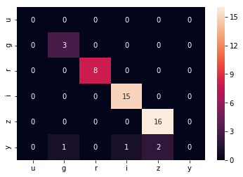
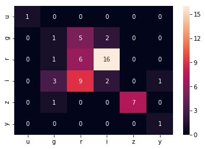

# Xiaolong - Week of  09/20/2019

## 1. Papers and code

### 1.1 Papers Read

[YOLO](https://arxiv.org/abs/1506.02640):  This paper introduced the YOLO, an algorithm for  real time object detection. 

### 1.2 Code Written

[phspaceMetric.ipynb](source/phspaceMetric.ipynb): I write a metric to evaluate the observations in parameter space, defined by color, and time gaps between two visits. It count the number of visits within time $\Delta t$ and plot the result as a heat map in filter space. 

## 2. Figures

Figure 1: The observation's filter style map of a field from baseline2018. Most of the two visits within 1.5 are in same filter.

Figure 2: The observation's filter style map of a field from pontus. Within 1.5 hours, more visits within 1.5 hours have different filter than baseline. 

## 3. Results

I write an metric to get the observation's filter style of an opsim database. It counts the number of visits within time $\Delta t$ for every pairs of filters. I run it for a random field on baseline2018 and pontus2573. As expected, pontus2573 has more filter changes. This metric is able to check whether our observation strategy is biased to some filters for a field or the whole sky. Need to make the code more general and apply to all field. There are two things need to discuss and define clearly, how to count the number of visits within time, and how to define a single number for each field. 