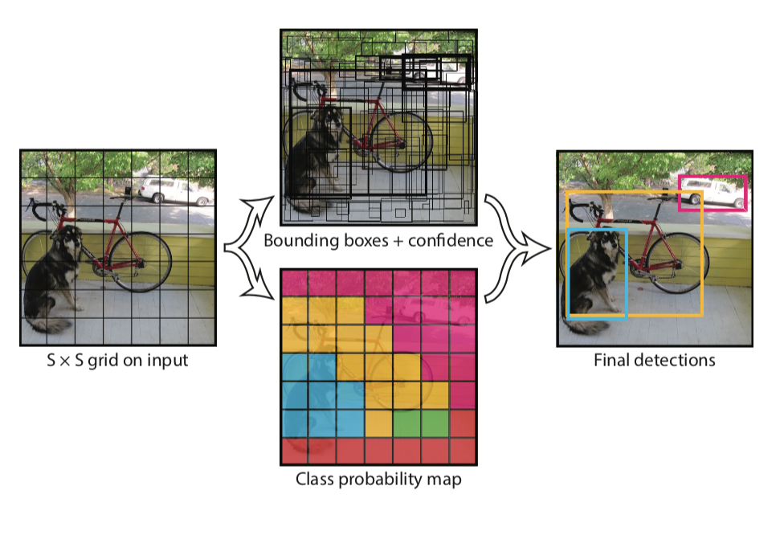
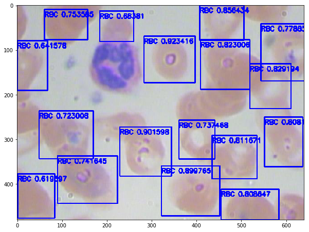

# Xiaolong - Week of  09/27/2019

## 1. Papers and code

### 1.1 Papers Read

Object Detection Algorithms:

- CNN: sliding window

- RCNN: regional based

- Fast RCNN: 

- Faster RCNN:

- [YOLO](https://arxiv.org/abs/1506.02640):  This paper introduced the YOLO, an algorithm for  real time object detection. 
- RetinaNet: 

### 1.2 Code Written

[BloodCellDetection.ipynb](source/BloodCellDetection.ipynb): I run an example of application of YOLO on cola, it trains again the last layer of a pretrained yolo model on about 400 labeled images of  red blood cells. 

## 2. Figures

Figure 1: The YOLO Model. It divides the image into an $S\times S$ grid and for each grid cell pridicts $B$ bounding boxes ($b_x, b_y, b_h, b_w$), confidence for those boxes ($p_b$), and $C$ class probabilities. It runs an input through a CNN and output an $S\times S \times (B*5 + C)$ tensor. 

Figure 2: The predicted bounding box for a picture contains many red blood cells.  

## 3. Results

I learned the YOLO object detection algorithm. It runs an image through CNN and  outputs a $S\times S \times (B*5 + C)$ tensor that contains the bounding box and confidence. Then it filters through all the boxes and selects the only one with highest probability. 