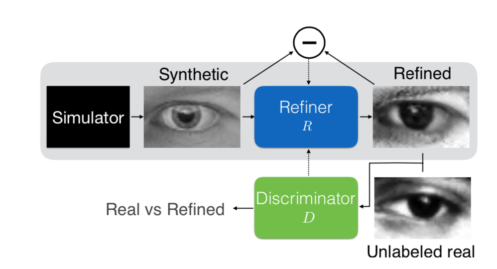

# Xiaolong - Week of  10/04/2019

## 1. Papers and code

### 1.1 Papers Read

[Learning From Simulated and Unsupervised Images through Adversarial Training](https://arxiv.org/abs/1612.07828):    This paper introduced the SimGAN, which apply adversarial networks to imporve the simulated images. 

### 1.2 Code Written

[filterPairsMetric.ipynb](source/filterPairsMetric.ipynb): I improve the filterPairsMetric. It can now calculate filter space matrix  for a part of the sky and can also plot skymap in galactic coordinate.

## 2. Figures

Figure 1: The structure of SimGAN. The output of the simulator is refined by a refiner network and the discriminator classifies an image as real or refined. 

## 3. Results

I learned the SimGAN. SimGAN is a Simulated + Unsupervised (S+U) learning framework. It replaces the random inputs used in generator of GAN with simulated images. Therefore the generator becomes an refiner. The refiner makes an simulated image more real and the discriminator tries to classifies an image as real or refined. SimGAN may be a good tool to improve the realism of simulated outputs.
