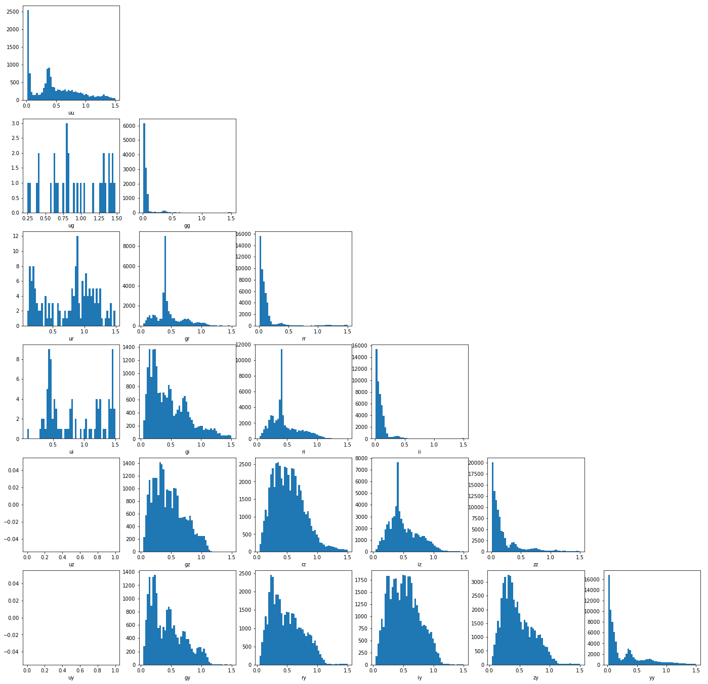

### Discover unknown

To evaluate LSST's ability to discover unknown phenomena, we plan to map its observation strategy to a multidimentional space using parameters like color, brightness etc.   Up to now, we created three metrics to analyze number of visits and fiveSigmaDepth for a single filter,  number of visits and time gaps for each filter pairs.  

**Ideas**:

- Compare Past survey with lsst Multidimensional cube, start with:
- Brightness
- Location
- rate of change between measurements
- Proper motion
- Color
- Shape (morphology)

**Data**:

- Opsim databases:   http://astro-lsst-01.astro.washington.edu:8081/
- Latest baseline https://lsst-web.ncsa.illinois.edu/sim-data/sims_featureScheduler_runs_1.3/baseline/

- All  columns (latest run)   https://github.com/lsst/sims_featureScheduler

**Needed columns**:	

- filter
- fiveSigmaDepth          
-  observationStartMJD/observationId/night

**Metrics available by now**:

- [filterNvisitsM5Metric](): written by Fabio, this metric counts the number of visits for each filter and plot a 2D array together the median of their fiveSigmaDepth. 

- [filterPairsMetric](source/filterPairsMetric.ipynb): 

- [timeGapsMetric](source/timeGapsMetric.ipynb): This metric extends the filterPairsMetric, 

  

**Results**: 

Figure 1. 

