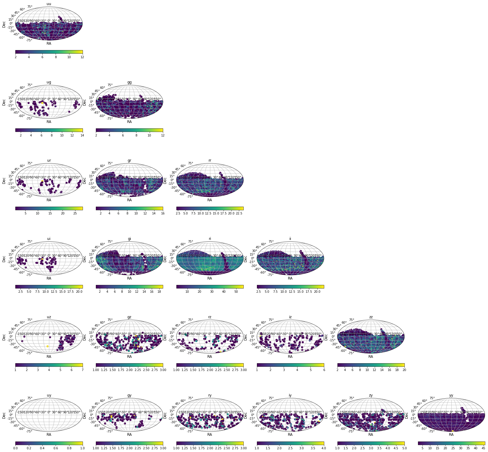

# Xiaolong - Week of 11/01/2019

## 1. Papers and code

### 1.1 Papers Read

[Wasserstein GAN](https://arxiv.org/abs/1701.07875): This paper introduced the WGAN, which is an alternative to traditional GAN. The WGAN modifies the loss function used in original GAN, thus it is more stable and get rid of problems like mode collapse. 

[HIGAN: Cosmic Neutral Hydrogen with Generative Adversarial Networks](https://arxiv.org/abs/1904.12846): This paper train a WGAN to generate cosmic HI web.  The generated mass density distributions are compared with gravity-only model and simulated ones. It shows that statistical properties such as 1D probability mass distribution, power spectrum, bispectrum, and voids abundance are kept by WGAN. 

### 1.2 Code Written

[timeGapsMetric.ipynb](source/timeGapsMetric): This metric calculate all possible time gaps between filters (takes about two hours to compute all 21 filter pairs for 600 nights). It can plot the histogram of time gaps for any filter pair, the minimum time gaps for each field, or the number of visits within a specific for each field. 

## 2. Figures

Figure 1: The skymap of the number of visits within 1.5 hours from presto cadence. It shows that we don't have enough visits in  uy, uz, ug, rz bands.

## 3. Results

I learned the WGAN which adjusts the loss function and get rid of problems like mode collapse. In the paper *arxiv.org/abs/1904.12846*,  they trained a WGAN using simulated cosmic hydrogen web from IllustrisTNG. The WGAN model successfully produce samples with similiar statisticl properties. The problem is that WGAN is not interpretable and it can not generate samples for different redshifts. 

Also, I ran timeGapsMetric on the latest baseline operation and presto. The plots show that latest baseline is much better than the baseline2018. Besides, both baseline and presto do not have enough visits in uy, uz, ug, rz bands. 