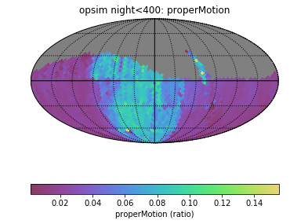

# Xiaolong - Week of 02/10/2020

## 1. Papers and code

### 1.1 Papers Read

[The Gaia-LSST Synergy](https://arxiv.org/abs/1502.06555): This paper discuss the synergy of Gaia and the LSST. Gaia has a magnitude limit r=20, and LSST will extend these measurements to r=27.5. Gaia and LSST will deliver trigonometric parallax, proper-motion and photometric measurements with similar uncertainties. Gaia and LSST datasets will be highly complementary and synergistic. And users of Gaia data have developed data analysis skills required to benefit from LSST data. 

### 1.2 Code Written

[properMotion.ipynb](): In this notebook, I run the *ProperMotionMetric*,  which calculate the uncertainty in the returned proper motion. I run this metric on the baseline and pontus opsim databases,  results are shown inside.

## 2. Figures

Figure 1: A comparison of the photometric, proper-motion, and the trigonometric parallax measurement uncertainties for SDSS, Gaia and LSST, as a function of apparent magnitude r. 

Figure 2: Compare the astrometric uncertainty to the uncertainty that would result if half the observations were taken at the start and half at the end. A perfect survey will have a value close to 1, while a poorly scheduled survey will be close to 0.

## 3. Results

Proper motion stands for angular motion in position over time of a star, measured in arctic per year. The different of proper motions of individual stars cause the shape of constellations to change. Combining the proper motions with the radial velocities and distances measured by Gaia, we will be able to determint the star's true motion through space over time. 

I I run the *ProperMotionMetric* to calculate the uncertainty in the returned proper motion for baseline operation. 

**Ref.**

https://www.esa.int/Science_Exploration/Space_Science/Gaia/Proper_motion

The motions of the stars http://www.astronomy.ohio-state.edu/~pogge/Ast162/Unit1/motions.html

https://faculty.virginia.edu/ASTR5610/lectures/VELOCITIES/velocities.html

