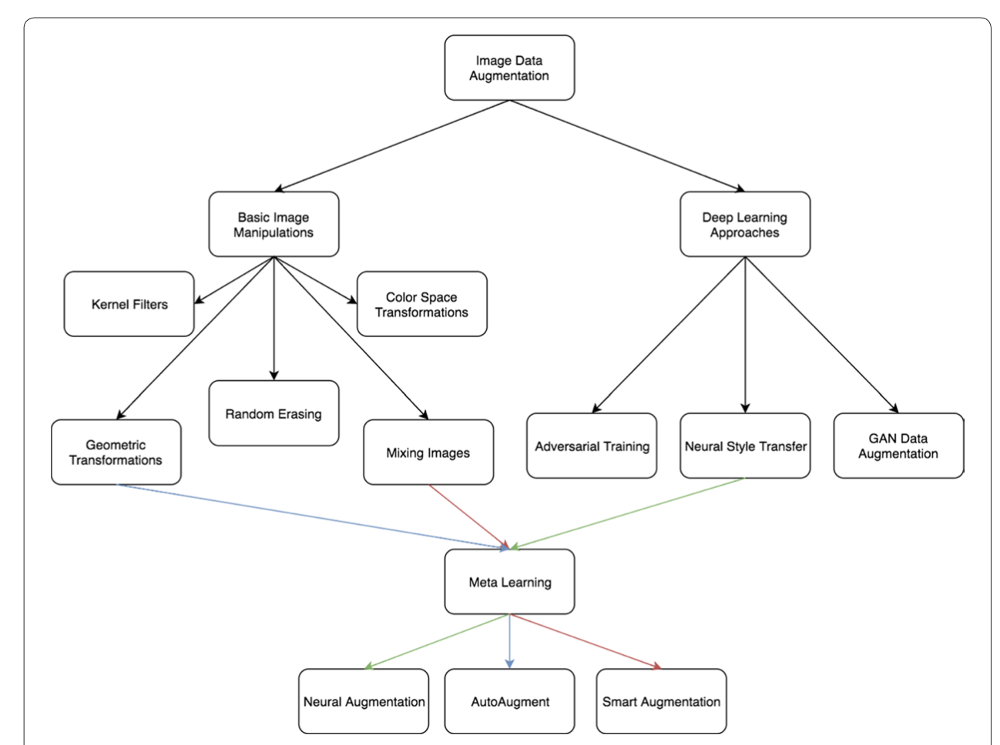

# Xiaolong - Week of 03/16/2020

## 1. Papers and code

### 1.1 Papers Read

[A survey on Image Data Augmentation for Deep Learning](https://doi.org/10.1186/s40537-019-0197-0): This paper review the techniques used to exhance the size and quality of training dataset. Including geometric transformations, color space augmentations, kernel filters, mixing images, random erasing feature space augmentation, adversarial training, generative adversarial networks, neural style transfer, and meta-learning. 

### 1.2 Code Written

[imgaug.ipynb](source/imgaug.ipynb): In this notebook, I learn some image data augmentation techniques using scikit-image and open cv library. 

## 2. Figures

Figure 1. Image data augmentation methods: basic image manipulations and neural network approaches.

## 3. Results

To achieve the automatic detection of light echoes, the first thing needed is to build a image dataset with high quality annotation. The current light echo dataset is relatively small used to train a detection network. To expand our dataset, we need to apply data augmentation techniques. I read a paper about this and learn some image augmentation methods including the basic image manipulations and deep learning approaches. Next, I will try to build a large light echo dataset used to training and validate our model. 

**Ref.**

cv2: openCV library

skimage: scikit-image 

Keras ImageDataGenerator:

Imgaug: 