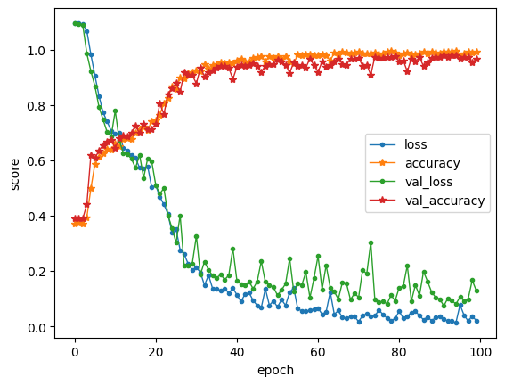
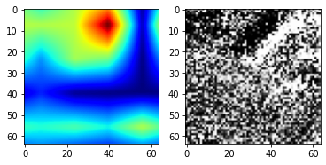

# Xiaolong - Week of 06/08/2020

## 1. Papers and code

### 1.1 Papers Read

[Grad-CAM: Visual Explanations from Deep Networks via Gradient-based Localization](https://arxiv.org/abs/1610.02391): this paper proposed a technique to visulize how CNN make decisions. It can create an heatmap which shows the importance of each pixel. Grad-CAM helps us understand neural networks, and it can serve as a simple way to localize objects. 

### 1.2 Code Written

[star64.ipynb](source/star64.ipynb):  Conv2D model to detection light echoes. 

[analysis_tgaps.ipynb](source/analysis_tgaps.ipynb):  In this notebooks I analysis the output of *filtTGapsMetric*. I updated the plots of distribution of time gaps. 

## 2. Figures

Figure 1:  The time gaps distribution from baseline 10 years compared with uniform distribution (log-uniform for diagonal part). The total number of visits and the KL divergence values are label on top of each subplots. A larger $D_k$ indicates this distribution is more off from a uniform distribution. 

Figure 2. The loss and accuracy on training and validation datasets of the Conv2D model. 

Figure 3: The heatmap from Grad-CAM. This heatmap shows which part of pixels led to final prediction of CNN model.  Grad-CAM can be a simple way to localize light echoes. 

## 3.Results

I build a Conv2D model to detect light echoes. The dataset contains about 3500 images in 3 different classes. It is gotten by splitting images from ALTAS to 64x64, and apply image augmentation methods (rotate + flip + add noise). My model achieves about 98% accuracy on both training and test sets. I use this model to detection some images from GAN. And also I use the Grad-CAM method to visulize the importance of each pixel. 

## 4. Next Steps

Improve image augmentation pipeline. 

Get some images from DECam. 

Learn  to run objection detection methods and build a light echo dataset for YOLO and Faster RCNN.  

Update overleaf documents of discover unknowns.

