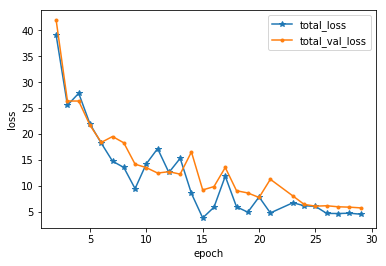
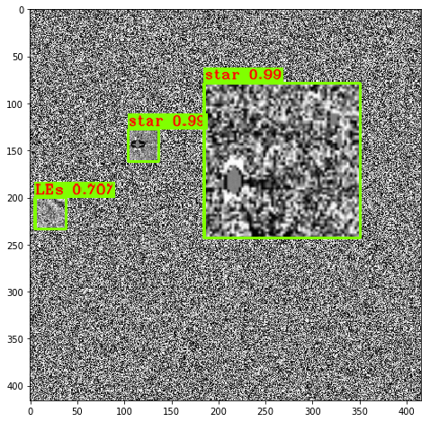
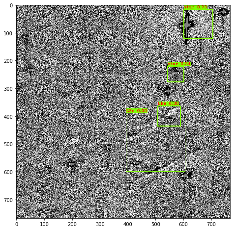

# Xiaolong - Week of 06/08/2020

## 1. Papers and code

### 1.1 Papers Read

[YOLOv3: An Incremental Improvement](https://pjreddie.com/media/files/papers/YOLOv3.pdf):  This paper presents some updates to YOLO. YOLOv3 uses Darknet-53 convolutional model as a feature extractor and predicts boundboxes at 3 different scales. 

### 1.2 Code Written

[make_yolo_imgs.ipynb](source/make_yolo_imgs.ipynb):  I build a dataset to train YOLO. I add 64*64 light echo images to gaussian background at random scales and positions, end at 1000 training images and 200 test images. 

[train_yolo.ipynb](source/train_yolo.ipynb): This notebook demostrates how to train YOLO v3 on google colab. It takes several hours to train on 1000 416*416 images. 

## 2. Figures

Figure 1:  The loss on training and validation datasets of YOLO v3.

Figure 2.  The YOLOv3 performs very well on test set. It can detect almost every patch I added to background.  

Figure 3: YOLOv3 detects something on the original ALTAS images but at lower confidence score. 

## 3.Results

I built a dataset used to train YOLO v3. The YOLOv3 got very high score on the test. It can also detect something in the new ALTAS images. Because my dataset is not real images, so YOLO v3 got low score on real images. Next I will try to improve my dataset. And learn how to evaulate objection detection model. 

## 4. Next Steps

Show false positive cases of Conv2D model.(Delivery: 06/25)

Learn to do image augmentation along with bound box. ( Delivery:06/25 )

Make better figures for project of discover unknowns. (Delivery:06/25 )

Learn how to evaulate objection detection model, ROC curve, mAP... 

Improve noise model of ALTAS images.

Build a dataset from ALTAS images to train YOLO. 

Learn to run Faster RCNN.  

