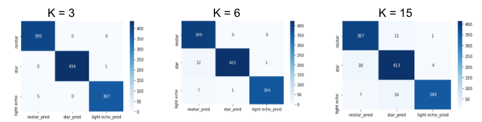
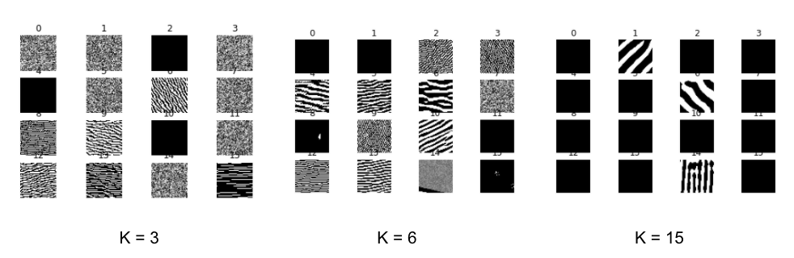

# Xiaolong - Week of 06/22/2020

## 1. Papers and code

### 1.1 Papers Read

[Fully Convolutional Networks for Semantic Segmentation](https://arxiv.org/abs/1411.4038):  ConvNets are  powerful models not only for  image classification, but also for semantic segmentation. This  paper show that a fully convolutional network (FCN), trained end-to-end, exceeds the state-of-the-art on semantic segmentation without further machinery. An input image is first downsampled by convolutional layers and then upsampled to same size as input to get the predicated segmenatation map. 

### 1.2 Code Written

[star64_v2.ipynb](source/star64_v2.ipynb) : I extract false positive images for Conv2D models with different filter size. And I take a look at what visual patterns models learned by creating input images that maximize the activation of specific filters. 

## 2. Figures

Figure 1:  The confusion matrixes for convolutional models with three different kernel size on test set. They all  got accuracy~0.99 on training set, but on test set,  larger filter size, lower score on  test set.

Figure 2.: The visual patterns corresponding to the first convolutinal layer. Small filter size learns more details on small textures; but less over large scale.

## 3.Results

I visualize what patterns Conv2D models with different kernel size learned. For 64*64 light echo images, kernel_size=3 got best result. Larger filter size, lower score on validation and test set. Larger filter size capture more information over large scale; but less in small scale. Larger filter size also means more parameters, therefore easier to overfitting on training set, and thus lower score on test set. 

## 4. Next Steps

Learn to run Faster RCNN, network structure, input data format and so on.  (Delivery 0702)

Build a dataset from ALTAS images for  YOLO and RCNN. 

Test Conv2D model with dataset at different noise levels.

Learn how to evaulate objection detection model, ROC curve, mAP... 

Improve noise model of ALTAS images.

