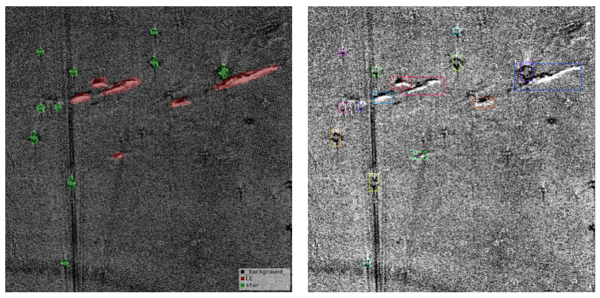

# Xiaolong - Week of 06/29/2020

## 1. Papers and code

### 1.1 Papers Read

[Object Detection with Deep Learning: A Review](https://arxiv.org/abs/1807.05511):  This paper reviews the deep learning object detection frameworks, including the region proposal based methods (RCNN, SSP-net, Fast RCNN, Faster RCNN, RFCN, FPN, and Mask R-CNN), and regression/classification based methods (MultiBox, AttentionNet, G-CNN, YOLO, SSD, DSSD, DSOD).

[Fully Convolutional Networks for Semantic Segmentation](https://arxiv.org/abs/1411.4038): This  paper show that a fully convolutional network (FCN) can be used for semantic segmentation.

## 2. Figures

Figure 1: I built a dataset in coco format,  including both segmentation masks and bounding boxes.   Tool used [ labelme](https://github.com/wkentaro/labelme). 

## 3.Results

I read a paper about semantic segmentation, it shows that a fully convolutional network trained end-to-end can used to image segmentation without further machinery. I built a dataset, which can be used to train segmentation model or object detection model. I will first try Faster RCNN.

## 4. Next Steps

Learn to run Faster RCNN, network structure, input data format and so on.  (Delivery 0709)

Build a dataset from ALTAS images for  YOLO and Faster RCNN. (Delivery 0709)

Learn how to evaulate objection detection model, ROC curve, mAP... (Delivery 0709)

Test Conv2D model with dataset at different noise levels.

Improve noise model of ALTAS images.

