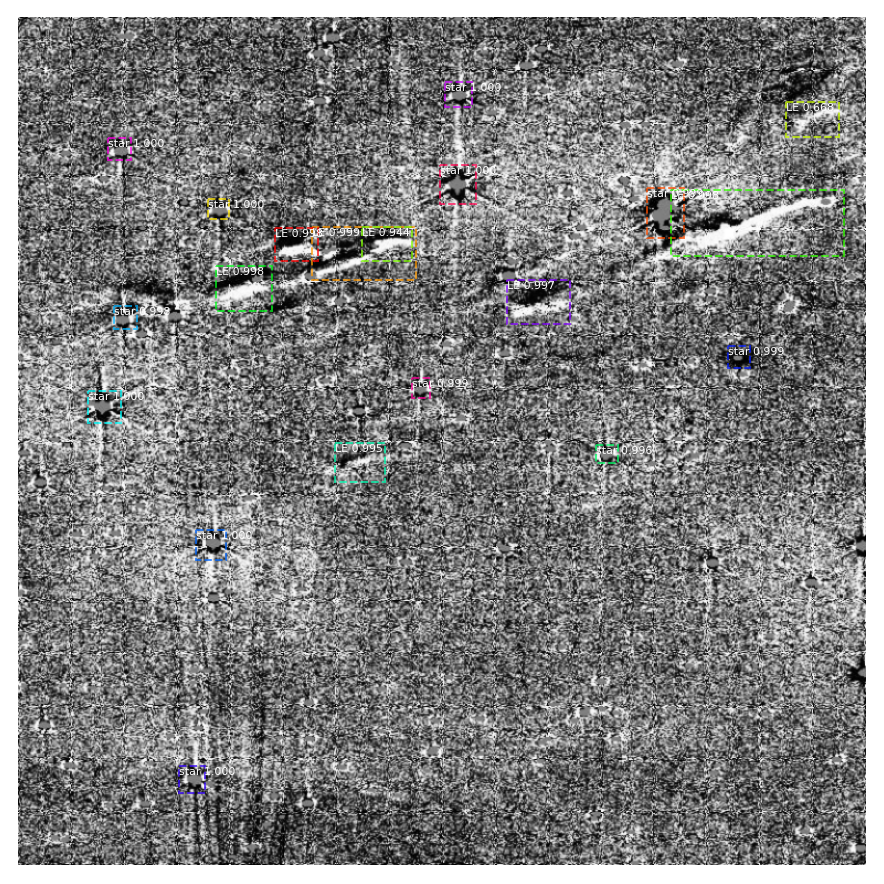

# Xiaolong - Week of 07/06/2020

## 1.Papers and code

### 1.1 Paper read

[Feature Pyramid Networks for Object Detection](https://arxiv.org/abs/1612.03144): This paper presents the Feature Pyramid Network(FPN). FPN learns features of images at multiple scales. Faster RCNN based on FPN achieves the best result on COCO dataset.

### 1.2 Code
[inspect_model.ipynb](source/inspect_model.ipynb): I trained Faster RCNN model to on ALTAS images to detect stars and light echoes.

: This notebook shows how to plot barh of FoM for opsims. 

## 2. Figures

Figure 1. The structure of Faster RCNN which apply FPN to generate a pyramid of feature maps. This structure is able to achieve higher accuracy than all existing methods. 

Figure 2. Trained the faster RCNN model to detect stars and light echoes. 

## 3. Results
I trained the ResNet101-FPN Faster RCNN model implemented with tensorflow 2.0 to detect light echoes. Because dataset is really small, it is easy to overfit on the training set. To prevent overfitting, early stopping is needed.   

## 4. Next Steps

Make better labels (Delivery 07/16)

Evaulate accuracy of the model (Delivery 07/16)

Try YOLO 

Start writing about light echo using Faster RCNN

Solve issues and improve description of discover unknown projects(Delivery 07/15) 

