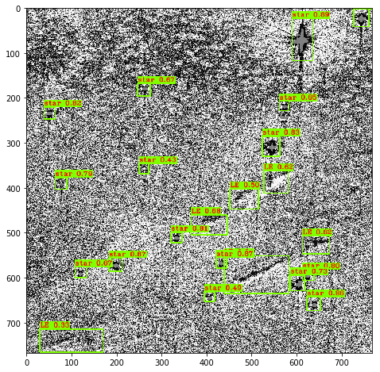

# Xiaolong - Week of 07/13/2020

## 1. Papers and code

### 1.1 Papers Read

[A deep learning approach for detecting candidates of supernova remnants](https://doi.org/10.1088/1674-4527/19/3/42):In this paper, the author applied convolutinal neural network to detect supernova remnants (SNR). They use data from Very Large Array Sky Survys to train a 5-layer Conv2D model, and they found that Conv2D model got the best accuracy than support vector machine and random forest.  

### 1.2 Code Written

[coco_to_yolo.ipynb](source/coco_to_yolo.ipynb): this notebook shows how to covert from coco dataset to yolo format. 

[explore_data.ipynb](source/explore_data.ipynb): check if boundboxes are corrected labeled

[LE_yolo_train.ipynb](source/LE_yolo_train.ipynb): train yolo

[yolo_detect](source/yolo_detect.ipynb): test yolo detection

## 2. Figures

Figure 1: An example of results from yolo, it performs very well on the training and test set.  

Figure 2: After rotation, yolo fails to predict one of light echoes. This means yolo is overfitting due to small training dataset.  

Figure 3: I explore the footprints of opsims. This figure shows the footprint by survey  'short'.

## 3.Results
I train the yolo to detecting light echoes. Yolo works very well on the training and test set. But it fails on the ratated images. This indicates that our model is overfitting on the training set. Data augmentation is needed to preventing overfitting.  

I explore the footprints of opsim databases. All opsims for WFD were created by survey noted as 

- blob, gr/iz...
- greedy

Five deep drilling fields were created by
- DD:290
- DD:COSMOS
- DD:ECDFS
- DD:ELAISS1
- DD:XMM-LSS
 
Three opsims have mini-survey:
- dcr_nham: high_am:u, high_am:g
- short: short
- twilight: twilight_neo 

 
## 4. Next Step

get latest ATLAS images

apply data augmentation and create labeled dataset (Delivery 07/23) 

evaulate detection model (Delivery 07/23) 

add dataset part to overleaf document 

solve the imblance problem 
